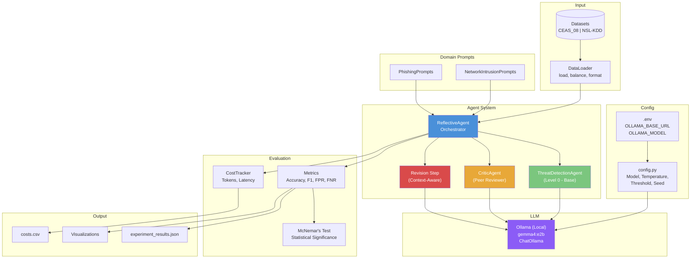
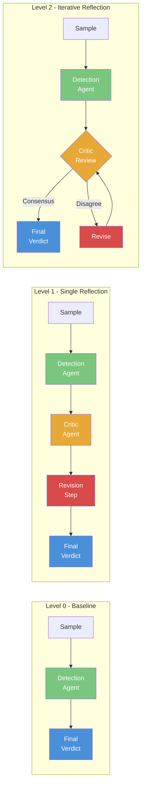

# Evaluating Self-Reflection and Error Correction Mechanisms in Agent-Based Defensive Security Threat Detection

## 🔀 Branch: `ollama` — Fully Local Inference

> **This branch runs entirely on local hardware via [Ollama](https://ollama.com/) using the `gemma4:e2b` model. No API keys, no cloud dependencies, no cost per inference.**
>
> For the original Google Gemini API version with full experimental results, see the [`main`](https://github.com/letusnotc/LLM-Self-Reflection---Security-Threats-Experiment/tree/main) branch.

---

## Table of Contents
- [Research Question](#research-question)
- [Introduction](#introduction)
- [What Changed (main → ollama)](#what-changed-main--ollama)
- [Threat Domains](#threat-domains)
- [What is Self-Reflection?](#what-is-self-reflection)
- [Tech Stack](#tech-stack)
- [System Architecture](#system-architecture)
- [Reflection Levels — Detailed Explanation](#reflection-levels--detailed-explanation)
- [LangChain Implementation Details](#langchain-implementation-details)
- [Project Structure](#project-structure)
- [Datasets](#datasets)
- [Setup & Usage](#setup--usage)
- [Hardware Requirements](#hardware-requirements)
- [Evaluation Metrics](#evaluation-metrics)
- [Limitations & Future Work](#limitations--future-work)

---

## Research Question

> **Does incorporating self-reflection and error correction significantly improve the accuracy and reliability of agent-based defensive security threat detection systems?**

We investigate whether an LLM agent that reviews, critiques, and revises its own threat assessments produces more accurate security verdicts than a single-pass analysis — and whether this benefit depends on model capability, domain complexity, and reflection depth.

---

## Introduction

Large Language Models (LLMs) have shown promise in cybersecurity tasks such as phishing detection, malware classification, and log analysis. However, single-pass LLM analysis is prone to errors — false positives that waste analyst time and false negatives that miss real threats.

**Self-reflection** is a technique where an AI agent reviews its own reasoning, identifies potential errors, and revises its output before delivering a final answer. This mirrors how human security analysts work: an initial assessment is reviewed by a senior analyst, who challenges assumptions and checks for blind spots.

This branch implements a **3-level reflection architecture** and evaluates it across **2 defensive security threat domains** using the **Gemma 4 E2B model via Ollama** (fully local) to answer:

1. Does reflection improve threat detection accuracy?
2. Can open-source local models handle structured self-reflection pipelines?
3. Which domains benefit most from self-reflection?
4. What is the cost-accuracy tradeoff of deeper reflection?

---

## What Changed (main → ollama)

| Aspect | `main` Branch | `ollama` Branch |
|--------|--------------|-----------------|
| **LLM Provider** | Google Gemini API (cloud) | Ollama (fully local) |
| **Model** | `gemini-2.5-flash-lite` | `gemma4:e2b` (7.2 GB) |
| **API Key Required** | Yes (`GOOGLE_API_KEY`) | No |
| **Cost per Run** | ~₹10-220 depending on model | **Free** |
| **Domains Tested** | 4 (phishing, network, malware, logs) | **2 (phishing, network)** |
| **Default Samples** | 100 per domain | **20 per domain** |
| **Rate Limiting** | 1s delay between API calls | None needed |
| **Dependencies** | `langchain-google-genai` | `langchain-ollama` |
| **Internet Required** | Yes (API calls) | **No** (after model download) |

### Why Only 2 Domains?

The `main` branch experiments showed that **malware PE analysis** (50% accuracy across all models — random chance) and **log-based insider threat detection** (37-50%) are fundamentally unsuited for LLM-based detection. LLMs cannot learn statistical distributions from raw numeric features in a single prompt. These domains were removed to focus on the two where LLMs actually provide value:

- **Phishing**: 93-100% baseline accuracy — text-based, clear indicators
- **Network Intrusion**: 90-100% baseline accuracy — structured patterns

---

## Threat Domains

### 1. Phishing Email Detection
- **Dataset**: CEAS_08 (39,154 emails — 21,842 phishing + 17,312 benign)
- **Input to LLM**: Email subject, sender address, and body text
- **Challenge**: Distinguishing sophisticated phishing from legitimate marketing emails, newsletters, and automated notifications
- **Key Indicators**: Spoofed domains, urgency language, suspicious URLs, social engineering patterns

### 2. Network Intrusion Detection (NSL-KDD)
- **Dataset**: NSL-KDD (125,972 connection records — 41 features per record)
- **Input to LLM**: Structured network connection features (duration, protocol, bytes, error rates, etc.)
- **Challenge**: Classifying network traffic as normal or attack (DoS, Probe, R2L, U2R) from numerical features
- **Key Indicators**: Traffic volume anomalies, failed login patterns, SYN flood signatures, port scan patterns

---

## What is Self-Reflection?

Self-reflection in AI agent systems is a mechanism where the agent **reviews, critiques, and revises its own output** before delivering a final answer. It is inspired by how expert human analysts work:

1. **Initial Analysis**: A junior analyst examines a threat sample and forms an opinion
2. **Peer Review**: A senior analyst reviews the assessment, challenges assumptions, and identifies blind spots
3. **Revision**: The junior analyst reconsiders their analysis in light of the feedback and produces a refined verdict

In our system, a single LLM plays all three roles through different prompts:
- **Detection Agent**: Performs the initial threat analysis
- **Critic Agent**: Reviews the analysis for errors, missed indicators, and logical gaps
- **Revision Step**: The agent reconsiders its verdict using the critic's feedback

### Why Self-Reflection Matters for Security

In cybersecurity, errors have asymmetric costs:
- **False Positives** (benign flagged as threat): Wastes analyst time, causes alert fatigue
- **False Negatives** (threat missed): Leads to undetected breaches, data loss, system compromise

Self-reflection aims to reduce both by forcing the agent to consider alternative explanations and challenge its initial assumptions.

---

## Tech Stack

| Component | Technology | Purpose |
|-----------|-----------|---------|
| **LLM Provider** | Ollama (local) | Fully local inference — no cloud, no API keys |
| **Model** | `gemma4:e2b` (7.2 GB) | Google's Gemma 4 model optimized for efficiency |
| **Agent Framework** | LangChain | Prompt management, chain composition, LLM abstraction |
| **LLM Integration** | `langchain-ollama` (`ChatOllama`) | LangChain ↔ Ollama bridge |
| **Prompt Templates** | `ChatPromptTemplate` (LangChain) | Structured prompts for detection, critic, and revision |
| **Chain Composition** | LangChain Expression Language (LCEL) | `prompt \| llm` pipeline for each agent step |
| **Output Parsing** | Manual JSON extraction + validation | Robust parsing of LLM JSON responses |
| **Evaluation** | scikit-learn, scipy | Accuracy, F1, ROC-AUC, McNemar's test |
| **Data Processing** | pandas | Dataset loading, preprocessing, balancing |
| **Visualization** | matplotlib, seaborn, plotly | Result charts and analysis figures |
| **Interactive Demo** | Streamlit | Web-based demo for individual sample analysis |
| **Configuration** | python-dotenv | Environment management |
| **Progress Tracking** | tqdm | Experiment progress bars |

---

## System Architecture



### Reflection Flow — All 3 Levels



---

## Reflection Levels — Detailed Explanation

### Level 0: Baseline (No Reflection)

```
Sample --> Detection Agent --> Verdict
              (1 LLM call)
```

The sample (email text or network features) is sent directly to the Detection Agent with a domain-specific system prompt. The agent analyzes the sample and returns a structured JSON verdict containing:
- `verdict`: "malicious" or "benign"
- `confidence`: 0.0 to 1.0
- `reasoning`: Step-by-step analysis
- `indicators`: List of key indicators found
- `threat_type`: Specific threat category

**This is the control group** — all improvements from reflection are measured against Level 0.

**LLM Calls**: 1 per sample

---

### Level 1: Single Reflection

```
Sample --> Detection Agent --> Critic Agent --> Revision --> Final Verdict
              (1 call)          (1 call)        (1 call)
```

**Step 1 — Initial Detection**: Same as Level 0. The Detection Agent produces an initial verdict.

**Step 2 — Critic Review**: The Critic Agent receives:
- The original sample
- The Detection Agent's full analysis (verdict, confidence, reasoning, indicators)
- Domain-specific review guidance (e.g., common false positive patterns for phishing)

The Critic outputs:
- `agree`: Whether it agrees with the original verdict
- `errors_found`: Specific errors in the analysis
- `overlooked_indicators`: Indicators the analyst may have missed
- `suggestions`: Specific improvements
- `revised_verdict`: The Critic's own assessment
- `revised_confidence`: The Critic's confidence

**Step 3 — Revision**: The Detection Agent revises its analysis using the Critic's feedback. The revision prompt is **context-aware** with three paths:
- **Critic agreed**: Agent refines reasoning and confidence, keeps verdict
- **Same verdict, different reasoning**: Agent improves reasoning while keeping verdict
- **Different verdict**: Agent compares evidence from both sides and decides which is stronger

**LLM Calls**: 3 per sample (always)

---

### Level 2: Iterative Reflection (Max 3 Rounds)

```
Sample --> Detection Agent --> [Critic --> Revise] x N --> Final Verdict
              (1 call)         (2 calls/round)
```

Same as Level 1, but the Critic-Revision cycle repeats up to 3 times until **consensus** is reached:

**Consensus Criteria** (all must be true):
1. Critic agrees with the current verdict (`agree: true`)
2. Critic's verdict matches the Detection Agent's verdict
3. Both the Critic's confidence and Detection Agent's confidence >= 0.7

If consensus is reached early, the loop stops — saving compute. If no consensus after 3 rounds, the last revised verdict is used.

On consensus, the final confidence is **blended** (average of agent and critic confidence) to reflect the mutual agreement.

**LLM Calls**: 2-7 per sample (depending on when consensus is reached)

---

## LangChain Implementation Details

### How LangChain is Used

The project uses LangChain as the LLM abstraction and prompt management layer. Here's how each component maps to LangChain:

#### 1. LLM Initialization (`config.py`)
```python
from langchain_ollama import ChatOllama

def get_llm(callbacks=None, **kwargs):
    return ChatOllama(
        model="gemma4:e2b",
        base_url="http://localhost:11434",
        temperature=0,  # Deterministic for reproducibility
        callbacks=callbacks or [],
    )
```
- `ChatOllama`: LangChain's integration with Ollama local inference
- `callbacks`: Used for token counting via `TokenCountingCallback`
- `temperature=0`: Ensures reproducible results across runs

#### 2. Prompt Templates (`ChatPromptTemplate`)
Each agent uses LangChain's `ChatPromptTemplate` to structure prompts:
```python
from langchain_core.prompts import ChatPromptTemplate

prompt = ChatPromptTemplate.from_messages([
    ("human", f"""{system_prompt}
    
    THREAT SAMPLE:
    {{sample}}
    
    Respond with JSON...""")
])
```
- Templates use `{variable}` syntax for dynamic content injection
- Double braces `{{{{}}}}` are used to show literal JSON examples in prompts

#### 3. Chain Composition (LCEL)
Prompts are composed with the LLM using LangChain Expression Language:
```python
chain = prompt | self.llm
response = chain.invoke({"sample": sample_text})
```
The `|` operator creates a pipeline: template renders → LLM processes → response returned.

#### 4. Output Parsing
The project uses **manual JSON parsing** instead of LangChain's structured output parsers, because:
- LLMs sometimes wrap JSON in markdown code blocks (` ```json ... ``` `)
- Responses need validation (verdict normalization, confidence clamping)
- Fallback behavior is needed when parsing fails

```python
content = response.content
if "```json" in content:
    content = content.split("```json")[1].split("```")[0]
result = json.loads(content.strip())
result["verdict"] = result["verdict"].lower().strip()
result["confidence"] = max(0.0, min(1.0, float(result["confidence"])))
```

#### 5. Callback System (Cost Tracking)
LangChain's callback system is used to track token usage:
```python
from langchain_core.callbacks import BaseCallbackHandler

class TokenCountingCallback(BaseCallbackHandler):
    def on_llm_end(self, response, **kwargs):
        # Ollama reports tokens in generation_info
        for gen_list in response.generations:
            for gen in gen_list:
                info = getattr(gen, "generation_info", {})
                usage = {
                    "prompt_tokens": info.get("prompt_eval_count", 0),
                    "completion_tokens": info.get("eval_count", 0),
                }
        self.cost_tracker.record_api_call(**usage)
```

---

## Project Structure

```
project/
├── .env                          # Ollama configuration (URL, model name)
├── requirements.txt              # Python dependencies
├── README.md                     # This file
│
├── src/
│   ├── __init__.py
│   ├── config.py                 # Ollama config, thresholds, paths
│   │
│   ├── agents/
│   │   ├── __init__.py
│   │   ├── base_agent.py         # Level 0: ThreatDetectionAgent
│   │   ├── critic_agent.py       # Critic: CriticAgent
│   │   └── reflective_agent.py   # Orchestrator: ReflectiveAgent (Levels 0/1/2)
│   │
│   ├── threats/
│   │   ├── __init__.py           # THREAT_DOMAINS registry (phishing + network only)
│   │   ├── phishing.py           # Phishing detection prompts + formatting
│   │   └── network_intrusion.py  # Network intrusion prompts + formatting
│   │
│   ├── data/
│   │   ├── __init__.py
│   │   └── loader.py             # DataLoader: CSV loading, balancing, synthetic fallback
│   │
│   └── evaluation/
│       ├── __init__.py
│       ├── metrics.py            # Accuracy, F1, McNemar's test
│       ├── cost_tracker.py       # Token counting, latency tracking
│       └── visualizations.py     # Result plotting
│
├── experiments/
│   ├── run_experiment.py         # Main experiment runner (CLI)
│   └── results/                  # JSON results + CSV cost data
│
├── data/
│   ├── phishing/
│   │   └── CEAS_08.csv           # 39,154 emails (phishing + benign)
│   └── network/
│       └── NSL-KDD_labeled.csv   # 125,972 network connection records
│
├── notebooks/
│   ├── 01_data_exploration.ipynb
│   ├── 02_experiment_analysis.ipynb
│   └── 03_paper_figures.ipynb
│
├── app/
│   └── streamlit_app.py          # Interactive demo
│
└── docs/                          # Research paper and presentation
```

---

## Datasets

| Domain | Dataset | Source | Samples | Features | Class Balance |
|--------|---------|--------|---------|----------|--------------|
| Phishing | CEAS_08 | CEAS 2008 Challenge | 39,154 | subject, sender, body | 56% phishing / 44% benign |
| Network | NSL-KDD | UNB Canada | 125,972 | 41 numeric features | Mixed attack types + normal |

All datasets are **balanced during loading** (equal malicious and benign samples) to prevent class imbalance from affecting results. A fixed random seed (`RANDOM_SEED=42`) ensures reproducibility.

If no CSV dataset is found in the `data/` directory, the loader automatically generates **synthetic samples** for testing.

---

## Setup & Usage

### Prerequisites
- **Python 3.11+**
- **Ollama** installed and running ([download here](https://ollama.com/))
- **gemma4:e2b model** pulled into Ollama

### 1. Install Ollama & Pull Model
```bash
# Install Ollama from https://ollama.com/
# Then pull the model:
ollama pull gemma4:e2b
```

### 2. Install Dependencies
```bash
pip install -r requirements.txt
```

### 3. Configure (Optional)
The `.env` file is pre-configured for default Ollama settings:
```
OLLAMA_BASE_URL=http://localhost:11434
OLLAMA_MODEL=gemma4:e2b
```

### 4. Run Experiments
```bash
# Full experiment — both domains, all 3 levels, 20 samples each
python -m experiments.run_experiment

# Quick test — 2 samples
python -m experiments.run_experiment --samples 2

# Single domain
python -m experiments.run_experiment --domain phishing --samples 10

# Single level
python -m experiments.run_experiment --level 0 --samples 5

# Combine options
python -m experiments.run_experiment --domain network_intrusion --level 2 --samples 5
```

### 5. Interactive Demo
```bash
streamlit run app/streamlit_app.py
```

### 6. Analysis Notebooks
```bash
jupyter notebook notebooks/
```

---

## Hardware Requirements

| Component | Minimum | Recommended |
|-----------|---------|-------------|
| **GPU VRAM** | 8 GB (RTX 3050 8GB, RTX 4060) | 12 GB+ (RTX 3060, RTX 4070) |
| **System RAM** | 16 GB | 32 GB |
| **Storage** | 10 GB free (model + datasets) | 20 GB |
| **OS** | Windows 10/11, macOS, Linux | Any with Ollama support |

### Compatible GPUs
- ✅ RTX 3060 (12 GB), RTX 3070, RTX 3080, RTX 4060, RTX 4070, RTX 4080, RTX 4090
- ✅ RTX 3050 (8 GB variant)
- ⚠️ GTX 1660 / RTX 3050 (6 GB) — model may not fit
- ❌ Integrated graphics — insufficient VRAM

> **Note**: Without a dedicated GPU, Ollama falls back to CPU inference which is significantly slower and requires the model size (7.2 GB) in free system RAM.

---

## Evaluation Metrics

| Metric | Description |
|--------|-------------|
| **Accuracy** | Overall correct predictions / total predictions |
| **Precision** | True positives / (True positives + False positives) — "When it says malicious, is it right?" |
| **Recall** | True positives / (True positives + False negatives) — "Does it catch all threats?" |
| **F1 Score** | Harmonic mean of Precision and Recall — balanced single metric |
| **FPR (False Positive Rate)** | Benign samples incorrectly flagged as threats |
| **FNR (False Negative Rate)** | Threats incorrectly classified as benign |
| **McNemar's Test** | Statistical test for comparing two classifiers on the same data (Level 0 vs Level 2) |

---

## Limitations & Future Work

### Current Limitations
1. **Local compute constraints**: `gemma4:e2b` requires 8 GB+ VRAM — not available on every machine
2. **Reduced sample size**: Default 20 samples vs 100 on the cloud version — may affect statistical power
3. **Single model**: Only testing one local model vs. three cloud models in the `main` branch
4. **Structured JSON output**: Smaller open-source models may struggle with consistent JSON formatting

### Future Work
- Test with larger local models (Llama 3.1 70B, Mixtral 8x22B) on GPU servers
- Fine-tune smaller models on structured JSON output for security domains
- Implement function calling / tool use for more reliable structured output
- Run larger sample sizes on GPU-equipped machines for statistical significance
- Compare local Gemma 4 results against cloud Gemini results from the `main` branch

---

## How to Reproduce

```bash
# Clone and checkout the ollama branch
git clone https://github.com/letusnotc/LLM-Self-Reflection---Security-Threats-Experiment.git
cd LLM-Self-Reflection---Security-Threats-Experiment
git checkout ollama

# Install Ollama and pull the model
ollama pull gemma4:e2b

# Install Python dependencies
pip install -r requirements.txt

# Run the full experiment
python -m experiments.run_experiment --samples 10

# Run specific domain
python -m experiments.run_experiment --domain phishing --samples 20

# Run specific level
python -m experiments.run_experiment --level 0 --samples 10
```

Results are saved to `experiments/results/` as JSON (predictions + metrics) and CSV (cost data).

---

## License

This project is for academic research purposes. Datasets are used under their respective licenses:
- CEAS_08: Research use
- NSL-KDD: Public domain (UNB Canada)
