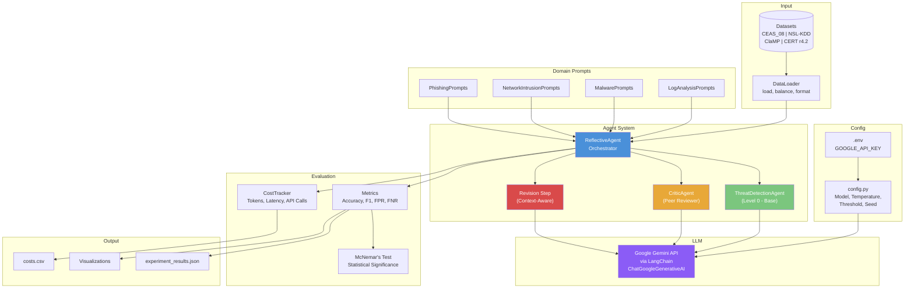
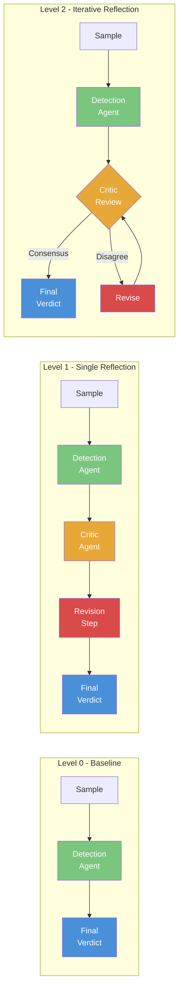

# Evaluating Self-Reflection and Error Correction Mechanisms in Agent-Based Defensive Security Threat Detection

## Table of Contents
- [Research Question](#research-question)
- [Introduction](#introduction)
- [Threat Domains](#threat-domains)
- [What is Self-Reflection?](#what-is-self-reflection)
- [Tech Stack](#tech-stack)
- [System Architecture](#system-architecture)
- [Reflection Levels — Detailed Explanation](#reflection-levels--detailed-explanation)
- [LangChain Implementation Details](#langchain-implementation-details)
- [Project Structure](#project-structure)
- [Datasets](#datasets)
- [Setup & Usage](#setup--usage)
- [Experimental Results](#experimental-results)
- [Model Comparison & Analysis](#model-comparison--analysis)
- [Key Findings](#key-findings)
- [Evaluation Metrics](#evaluation-metrics)
- [Cost Analysis](#cost-analysis)
- [Limitations & Future Work](#limitations--future-work)

---

## Research Question

> **Does incorporating self-reflection and error correction significantly improve the accuracy and reliability of agent-based defensive security threat detection systems?**

We investigate whether an LLM agent that reviews, critiques, and revises its own threat assessments produces more accurate security verdicts than a single-pass analysis — and whether this benefit depends on model capability, domain complexity, and reflection depth.

---

## Introduction

Large Language Models (LLMs) have shown promise in cybersecurity tasks such as phishing detection, malware classification, and log analysis. However, single-pass LLM analysis is prone to errors — false positives that waste analyst time and false negatives that miss real threats.

**Self-reflection** is a technique where an AI agent reviews its own reasoning, identifies potential errors, and revises its output before delivering a final answer. This mirrors how human security analysts work: an initial assessment is reviewed by a senior analyst, who challenges assumptions and checks for blind spots.

This project implements a **3-level reflection architecture** and evaluates it across **4 defensive security threat domains** using **3 different Gemini models** to answer:

1. Does reflection improve threat detection accuracy?
2. Does the benefit depend on model capability?
3. Which domains benefit most from self-reflection?
4. What is the cost-accuracy tradeoff of deeper reflection?

---

## Threat Domains

The system is evaluated across 4 distinct defensive security domains, each with unique characteristics and challenges:

### 1. Phishing Email Detection
- **Dataset**: CEAS_08 (39,154 emails — 21,842 phishing + 17,312 benign)
- **Input to LLM**: Email subject, sender address, and body text
- **Challenge**: Distinguishing sophisticated phishing from legitimate marketing emails, newsletters, and automated notifications
- **Key Indicators**: Spoofed domains, urgency language, suspicious URLs, social engineering patterns

### 2. Network Intrusion Detection (NSL-KDD)
- **Dataset**: NSL-KDD (125,972 connection records — 41 features per record)
- **Input to LLM**: Structured network connection features (duration, protocol, bytes, error rates, etc.)
- **Challenge**: Classifying network traffic as normal or attack (DoS, Probe, R2L, U2R) from numerical features
- **Key Indicators**: Traffic volume anomalies, failed login patterns, SYN flood signatures, port scan patterns

### 3. Malware Analysis (PE Features)
- **Dataset**: ClaMP Integrated (5,210 PE files — 70 features per file)
- **Input to LLM**: PE header features, entropy values, section structure, compiler info, packer detection
- **Challenge**: Classifying Windows executables as malware or legitimate from raw PE header features — a highly technical domain requiring specialized knowledge
- **Key Indicators**: Entropy patterns, suspicious sections, file metadata, linker version anomalies

### 4. Log-Based Insider Threat Detection
- **Dataset**: CERT Insider Threat Dataset r4.2 (242,228 events — 94.7% benign, 5.3% malicious)
- **Input to LLM**: Sliding window of 7 consecutive employee log events (logon, device, file, email, http)
- **Challenge**: Identifying insider threat behavioral patterns (e.g., USB connect → file copy → disconnect) from sparse, noisy log data
- **Key Indicators**: USB device usage patterns, off-hours activity, file access sequences, data movement anomalies

---

## What is Self-Reflection?

Self-reflection in AI agent systems is a mechanism where the agent **reviews, critiques, and revises its own output** before delivering a final answer. It is inspired by how expert human analysts work:

1. **Initial Analysis**: A junior analyst examines a threat sample and forms an opinion
2. **Peer Review**: A senior analyst reviews the assessment, challenges assumptions, and identifies blind spots
3. **Revision**: The junior analyst reconsiders their analysis in light of the feedback and produces a refined verdict

In our system, a single LLM plays all three roles through different prompts:
- **Detection Agent**: Performs the initial threat analysis
- **Critic Agent**: Reviews the analysis for errors, missed indicators, and logical gaps
- **Revision Step**: The agent reconsiders its verdict using the critic's feedback

The key research question is whether this multi-step process produces better results than the initial single-pass analysis, and at what cost.

### Why Self-Reflection Matters for Security

In cybersecurity, errors have asymmetric costs:
- **False Positives** (benign flagged as threat): Wastes analyst time, causes alert fatigue
- **False Negatives** (threat missed): Leads to undetected breaches, data loss, system compromise

Self-reflection aims to reduce both by forcing the agent to consider alternative explanations and challenge its initial assumptions.

---

## Tech Stack

| Component | Technology | Purpose |
|-----------|-----------|---------|
| **LLM Provider** | Google Gemini API | Cloud-hosted language models for threat analysis |
| **Agent Framework** | LangChain | Prompt management, chain composition, LLM abstraction |
| **Prompt Templates** | `ChatPromptTemplate` (LangChain) | Structured prompts for detection, critic, and revision |
| **Chain Composition** | LangChain Expression Language (LCEL) | `prompt \| llm` pipeline for each agent step |
| **Output Parsing** | Manual JSON extraction + validation | Robust parsing of LLM JSON responses |
| **Evaluation** | scikit-learn, scipy | Accuracy, F1, ROC-AUC, McNemar's test |
| **Data Processing** | pandas | Dataset loading, preprocessing, windowing |
| **Visualization** | matplotlib, seaborn, plotly | Result charts and analysis figures |
| **Interactive Demo** | Streamlit | Web-based demo for individual sample analysis |
| **Configuration** | python-dotenv | API key and environment management |
| **Progress Tracking** | tqdm | Experiment progress bars |

### Models Tested

| Model | Type | Input Cost | Output Cost | Key Characteristic |
|-------|------|-----------|-------------|-------------------|
| `gemini-2.5-flash-lite` | Lightweight | $0.075/1M tokens | $0.30/1M tokens | Fast, cheap, no thinking tokens |
| `gemini-2.5-flash` | Hybrid reasoning | $0.15/1M tokens | $0.60/1M + $3.50/1M thinking | Thinking tokens for deeper reasoning |
| `gemini-3-flash-preview` | Frontier intelligence | $0.50/1M tokens | $3.00/1M tokens | Most capable reasoning model |
| Ollama (local models) | Open-source | Free | Free | Failed to produce structured JSON output |

---

## System Architecture



### Reflection Flow — All 3 Levels



---

## Reflection Levels — Detailed Explanation

### Level 0: Baseline (No Reflection)

```
Sample --> Detection Agent --> Verdict
              (1 LLM call)
```

The sample (email text, network features, PE features, or log window) is sent directly to the Detection Agent with a domain-specific system prompt. The agent analyzes the sample and returns a structured JSON verdict containing:
- `verdict`: "malicious" or "benign"
- `confidence`: 0.0 to 1.0
- `reasoning`: Step-by-step analysis
- `indicators`: List of key indicators found
- `threat_type`: Specific threat category

**This is the control group** — all improvements from reflection are measured against Level 0.

**LLM Calls**: 1 per sample

---

### Level 1: Single Reflection

```
Sample --> Detection Agent --> Critic Agent --> Revision --> Final Verdict
              (1 call)          (1 call)        (1 call)
```

**Step 1 — Initial Detection**: Same as Level 0. The Detection Agent produces an initial verdict.

**Step 2 — Critic Review**: The Critic Agent receives:
- The original sample
- The Detection Agent's full analysis (verdict, confidence, reasoning, indicators)
- Domain-specific review guidance (e.g., common false positive patterns for phishing)

The Critic outputs:
- `agree`: Whether it agrees with the original verdict
- `errors_found`: Specific errors in the analysis
- `overlooked_indicators`: Indicators the analyst may have missed
- `suggestions`: Specific improvements
- `revised_verdict`: The Critic's own assessment
- `revised_confidence`: The Critic's confidence

**Step 3 — Revision**: The Detection Agent revises its analysis using the Critic's feedback. The revision prompt is **context-aware** with three paths:
- **Critic agreed**: Agent refines reasoning and confidence, keeps verdict
- **Same verdict, different reasoning**: Agent improves reasoning while keeping verdict
- **Different verdict**: Agent compares evidence from both sides and decides which is stronger

**LLM Calls**: 3 per sample (always)

---

### Level 2: Iterative Reflection (Max 3 Rounds)

```
Sample --> Detection Agent --> [Critic --> Revise] x N --> Final Verdict
              (1 call)         (2 calls/round)
```

Same as Level 1, but the Critic-Revision cycle repeats up to 3 times until **consensus** is reached:

**Consensus Criteria** (all must be true):
1. Critic agrees with the current verdict (`agree: true`)
2. Critic's verdict matches the Detection Agent's verdict
3. Both the Critic's confidence and Detection Agent's confidence >= 0.7

If consensus is reached early, the loop stops — saving API calls and cost. If no consensus after 3 rounds, the last revised verdict is used.

On consensus, the final confidence is **blended** (average of agent and critic confidence) to reflect the mutual agreement.

**LLM Calls**: 2-7 per sample (depending on when consensus is reached)

---

## LangChain Implementation Details

### How LangChain is Used

The project uses LangChain as the LLM abstraction and prompt management layer. Here's how each component maps to LangChain:

#### 1. LLM Initialization (`config.py`)
```python
from langchain_google_genai import ChatGoogleGenerativeAI

def get_llm(callbacks=None, **kwargs):
    return ChatGoogleGenerativeAI(
        model="gemini-2.5-flash-lite",
        google_api_key=GOOGLE_API_KEY,
        temperature=0,  # Deterministic for reproducibility
        callbacks=callbacks or [],
    )
```
- `ChatGoogleGenerativeAI`: LangChain's integration with Google Gemini API
- `callbacks`: Used for token counting via `TokenCountingCallback`
- `temperature=0`: Ensures reproducible results across runs

#### 2. Prompt Templates (`ChatPromptTemplate`)
Each agent uses LangChain's `ChatPromptTemplate` to structure prompts:
```python
from langchain_core.prompts import ChatPromptTemplate

prompt = ChatPromptTemplate.from_messages([
    ("human", f"""{system_prompt}
    
    THREAT SAMPLE:
    {{sample}}
    
    Respond with JSON...""")
])
```
- Templates use `{variable}` syntax for dynamic content injection
- Double braces `{{{{}}}}` are used to show literal JSON examples in prompts

#### 3. Chain Composition (LCEL)
Prompts are composed with the LLM using LangChain Expression Language:
```python
chain = prompt | self.llm
response = chain.invoke({"sample": sample_text})
```
The `|` operator creates a pipeline: template renders → LLM processes → response returned.

#### 4. Output Parsing
The project uses **manual JSON parsing** instead of LangChain's structured output parsers, because:
- LLMs sometimes wrap JSON in markdown code blocks (``` ```json ... ``` ```)
- Responses need validation (verdict normalization, confidence clamping)
- Fallback behavior is needed when parsing fails

```python
content = response.content
if "```json" in content:
    content = content.split("```json")[1].split("```")[0]
result = json.loads(content.strip())
result["verdict"] = result["verdict"].lower().strip()
result["confidence"] = max(0.0, min(1.0, float(result["confidence"])))
```

#### 5. Pydantic Models (Schema Definition)
LangChain's Pydantic integration is used to define expected output schemas:
```python
from pydantic import BaseModel, Field

class ThreatVerdict(BaseModel):
    verdict: str = Field(description="Either 'malicious' or 'benign'")
    confidence: float = Field(description="Confidence score between 0.0 and 1.0")
    reasoning: str = Field(description="Step-by-step reasoning")
    indicators: list[str] = Field(description="Key indicators found")
    threat_type: Optional[str] = Field(default=None)
```

#### 6. Callback System (Cost Tracking)
LangChain's callback system is used to track token usage:
```python
from langchain_core.callbacks import BaseCallbackHandler

class TokenCountingCallback(BaseCallbackHandler):
    def on_llm_end(self, response, **kwargs):
        usage = response.llm_output.get("token_usage", {})
        self.cost_tracker.record_api_call(
            prompt_tokens=usage.get("prompt_tokens", 0),
            completion_tokens=usage.get("completion_tokens", 0),
        )
```

---

## Project Structure

```
project/
├── .env                          # API key configuration
├── requirements.txt              # Python dependencies
├── README.md                     # This file
│
├── src/
│   ├── __init__.py
│   ├── config.py                 # Model config, thresholds, paths
│   │
│   ├── agents/
│   │   ├── __init__.py
│   │   ├── base_agent.py         # Level 0: ThreatDetectionAgent
│   │   ├── critic_agent.py       # Critic: CriticAgent
│   │   └── reflective_agent.py   # Orchestrator: ReflectiveAgent (Levels 0/1/2)
│   │
│   ├── threats/
│   │   ├── __init__.py           # THREAT_DOMAINS registry
│   │   ├── phishing.py           # Phishing detection prompts + formatting
│   │   ├── network_intrusion.py  # Network intrusion prompts + formatting
│   │   ├── malware.py            # Malware PE analysis prompts + formatting
│   │   └── log_analysis.py       # Insider threat log prompts + formatting
│   │
│   ├── data/
│   │   ├── __init__.py
│   │   └── loader.py             # DataLoader: CSV loading, windowing, balancing
│   │
│   └── evaluation/
│       ├── __init__.py
│       ├── metrics.py            # Accuracy, F1, McNemar's test
│       ├── cost_tracker.py       # Token counting, latency tracking
│       └── visualizations.py     # Result plotting
│
├── experiments/
│   ├── run_experiment.py         # Main experiment runner (CLI)
│   └── results/                  # JSON results + CSV cost data
│
├── data/
│   ├── phishing/
│   │   └── CEAS_08.csv           # 39,154 emails (phishing + benign)
│   ├── network/
│   │   └── NSL-KDD_labeled.csv   # 125,972 network connection records
│   ├── malware/
│   │   └── ClaMP_Integrated-5184.csv  # 5,210 PE file feature sets
│   └── logs/
│       ├── auth_logs_small.csv   # 242,228 CERT insider threat events
│       └── readme.md             # Dataset documentation
│
├── notebooks/
│   ├── 01_data_exploration.ipynb
│   ├── 02_experiment_analysis.ipynb
│   └── 03_paper_figures.ipynb
│
├── app/
│   └── streamlit_app.py          # Interactive demo
│
└── docs/                          # Research paper and presentation
```

---

## Datasets

| Domain | Dataset | Source | Samples | Features | Class Balance |
|--------|---------|--------|---------|----------|--------------|
| Phishing | CEAS_08 | CEAS 2008 Challenge | 39,154 | subject, sender, body | 56% phishing / 44% benign |
| Network | NSL-KDD | UNB Canada | 125,972 | 41 numeric features | Mixed attack types + normal |
| Malware | ClaMP | Kaggle | 5,210 | 70 PE header features | 52% malware / 48% benign |
| Logs | CERT r4.2 | CMU/SEI | 242,228 | 16 event fields | 5.3% insider threat / 94.7% benign |

All datasets are **balanced during loading** (equal malicious and benign samples) to prevent class imbalance from affecting results. A fixed random seed (`RANDOM_SEED=42`) ensures reproducibility.

---

## Setup & Usage

### 1. Install Dependencies
```bash
pip install -r requirements.txt
```

### 2. Configure API Key
Create a `.env` file:
```
GOOGLE_API_KEY=your-gemini-api-key-here
```

### 3. Run Experiments
```bash
# Full experiment — all 4 domains, all 3 levels, 100 samples each
python -m experiments.run_experiment

# Quick test — 10 samples
python -m experiments.run_experiment --samples 10

# Single domain
python -m experiments.run_experiment --domain phishing --samples 20

# Single level
python -m experiments.run_experiment --level 0 --samples 10
```

### 4. Interactive Demo
```bash
streamlit run app/streamlit_app.py
```

### 5. Analysis Notebooks
```bash
jupyter notebook notebooks/
```

---

## Experimental Results

We ran experiments across 3 Gemini models to evaluate how self-reflection performs at different model capability levels.

### Experiment 1: Gemini 2.5 Flash-Lite (30 samples)
*Lightweight model, no thinking tokens, fastest and cheapest*

| Domain | Level | Accuracy | Precision | Recall | F1 | FPR | FNR |
|--------|-------|----------|-----------|--------|-----|-----|-----|
| **Phishing** | L0 | **0.9333** | 0.8824 | 1.0000 | **0.9375** | 0.1333 | 0.0000 |
| | L1 | 0.9333 | 1.0000 | 0.8667 | 0.9286 | 0.0000 | 0.1333 |
| | L2 | 0.8000 | 1.0000 | 0.6000 | 0.7500 | 0.0000 | 0.4000 |
| **Network** | L0 | **0.9000** | 0.8750 | 0.9333 | **0.9032** | 0.1333 | 0.0667 |
| | L1 | 0.8000 | 0.9091 | 0.6667 | 0.7692 | 0.0667 | 0.3333 |
| | L2 | 0.7333 | 0.8889 | 0.5333 | 0.6667 | 0.0667 | 0.4667 |
| **Malware** | L0 | 0.5000 | 0.5000 | 1.0000 | 0.6667 | 1.0000 | 0.0000 |
| | L1 | 0.3667 | 0.3000 | 0.2000 | 0.2400 | 0.4667 | 0.8000 |
| | L2 | 0.5000 | 0.5000 | 0.2667 | 0.3478 | 0.2667 | 0.7333 |
| **Logs** | L0 | 0.3667 | 0.3571 | 0.3333 | 0.3448 | 0.6000 | 0.6667 |
| | L1 | 0.5000 | 0.0000 | 0.0000 | 0.0000 | 0.0000 | 1.0000 |
| | L2 | 0.5000 | 0.0000 | 0.0000 | 0.0000 | 0.0000 | 1.0000 |

**Reflection Impact (L0 → L2):**

| Domain | L0 Acc | L2 Acc | Change | L0 F1 | L2 F1 | Change |
|--------|--------|--------|--------|-------|-------|--------|
| Phishing | 0.9333 | 0.8000 | -0.1333 | 0.9375 | 0.7500 | -0.1875 |
| Network | 0.9000 | 0.7333 | -0.1667 | 0.9032 | 0.6667 | -0.2366 |
| Malware | 0.5000 | 0.5000 | 0.0000 | 0.6667 | 0.3478 | -0.3188 |
| Logs | 0.3667 | 0.5000 | +0.1333 | 0.3448 | 0.0000 | -0.3448 |

> **Key Finding**: With `flash-lite`, self-reflection consistently **degrades performance**. The model is too weak for multi-step reasoning — the critic second-guesses correct answers, and the revision agent caves to the critic's suggestions rather than defending its original analysis.

---

### Experiment 2: Gemini 2.5 Flash (6 samples)
*Hybrid reasoning model with thinking tokens*

| Domain | Level | Accuracy | Precision | Recall | F1 | FPR | FNR |
|--------|-------|----------|-----------|--------|-----|-----|-----|
| **Phishing** | L0 | **1.0000** | 1.0000 | 1.0000 | **1.0000** | 0.0000 | 0.0000 |
| | L1 | 1.0000 | 1.0000 | 1.0000 | 1.0000 | 0.0000 | 0.0000 |
| | L2 | 1.0000 | 1.0000 | 1.0000 | 1.0000 | 0.0000 | 0.0000 |
| **Network** | L0 | **1.0000** | 1.0000 | 1.0000 | **1.0000** | 0.0000 | 0.0000 |
| | L1 | 1.0000 | 1.0000 | 1.0000 | 1.0000 | 0.0000 | 0.0000 |
| | L2 | 1.0000 | 1.0000 | 1.0000 | 1.0000 | 0.0000 | 0.0000 |
| **Malware** | L0 | 0.5000 | 0.5000 | 1.0000 | 0.6667 | 1.0000 | 0.0000 |
| | L1 | 0.5000 | 0.5000 | 1.0000 | 0.6667 | 1.0000 | 0.0000 |
| | L2 | 0.5000 | 0.5000 | 1.0000 | 0.6667 | 1.0000 | 0.0000 |
| **Logs** | L0 | 0.5000 | 0.5000 | 1.0000 | 0.6667 | 1.0000 | 0.0000 |
| | L1 | 0.5000 | 0.5000 | 1.0000 | 0.6667 | 1.0000 | 0.0000 |
| | L2 | 0.5000 | 0.5000 | 1.0000 | 0.6667 | 1.0000 | 0.0000 |

> **Key Finding**: `gemini-2.5-flash` achieves perfect accuracy on text-based domains (phishing, network) but shows a **ceiling effect** — reflection has nothing to improve. On structured data domains (malware, logs), it fails at the same 50% rate as the lighter model.

---

### Experiment 3: Gemini 3 Flash Preview (10 samples)
*Most intelligent Gemini model, frontier reasoning*

| Domain | Level | Accuracy | Precision | Recall | F1 | FPR | FNR |
|--------|-------|----------|-----------|--------|-----|-----|-----|
| **Phishing** | L0 | **1.0000** | 1.0000 | 1.0000 | **1.0000** | 0.0000 | 0.0000 |
| | L1 | 1.0000 | 1.0000 | 1.0000 | 1.0000 | 0.0000 | 0.0000 |
| | L2 | 1.0000 | 1.0000 | 1.0000 | 1.0000 | 0.0000 | 0.0000 |
| **Network** | L0 | **1.0000** | 1.0000 | 1.0000 | **1.0000** | 0.0000 | 0.0000 |
| | L1 | 1.0000 | 1.0000 | 1.0000 | 1.0000 | 0.0000 | 0.0000 |
| | L2 | 1.0000 | 1.0000 | 1.0000 | 1.0000 | 0.0000 | 0.0000 |
| **Malware** | L0 | 0.5000 | 0.5000 | 1.0000 | 0.6667 | 1.0000 | 0.0000 |
| | L1 | 0.5000 | 0.5000 | 1.0000 | 0.6667 | 1.0000 | 0.0000 |
| | L2 | 0.5000 | 0.5000 | 1.0000 | 0.6667 | 1.0000 | 0.0000 |
| **Logs** | L0 | 0.4000 | 0.4444 | 0.8000 | 0.5714 | 1.0000 | 0.2000 |
| | L1 | 0.2000 | 0.2000 | 0.2000 | 0.2000 | 0.8000 | 0.8000 |
| | L2 | 0.3000 | 0.3333 | 0.4000 | 0.3636 | 0.8000 | 0.6000 |

> **Key Finding**: The most capable Gemini model confirms the pattern — perfect on text-based domains, unable to classify raw PE features. On logs, reflection **hurts performance** (L0: 40% → L2: 30%), suggesting the critic destabilizes correct verdicts in ambiguous domains.

---

## Model Comparison & Analysis

### Why We Used Paid Gemini Models

We initially attempted to use **open-source models via Ollama** (Llama 3, Mistral, Gemma) for cost-free experimentation. However, these models **failed to produce valid structured JSON output** consistently:
- Responses were often malformed or wrapped in conversational text
- Models could not follow the strict `"Respond ONLY with JSON"` instruction
- The multi-step reflection pipeline requires each step to produce parseable JSON — a single parse failure in the critic or revision step breaks the entire chain
- Smaller open-source models lacked the reasoning capability to meaningfully critique and revise security analyses

This led us to adopt Google's Gemini API models, which reliably produce structured JSON and offer the reasoning depth needed for self-reflection experiments.

### Model Capability vs. Reflection Benefit

| Model | Phishing L0 | Network L0 | Reflection Helps? | Why |
|-------|------------|------------|-------------------|-----|
| `flash-lite` | 93.3% | 90.0% | **No — hurts** | Too weak to be a good critic; caves during revision |
| `2.5-flash` | 100% | 100% | **Neutral — ceiling** | Already perfect; nothing to improve |
| `3-flash-preview` | 100% | 100% | **Neutral — ceiling** | Already perfect; nothing to improve |

### Domain Difficulty Analysis

| Domain | Best L0 Accuracy | Can LLMs Handle It? | Why |
|--------|-----------------|--------------------|----|
| **Phishing** | 93-100% | Yes — text understanding | LLMs excel at natural language; phishing emails contain clear textual signals |
| **Network** | 90-100% | Yes — pattern recognition | NSL-KDD features form recognizable attack patterns (SYN floods, port scans) |
| **Malware** | 50% (all models) | **No — raw numeric features** | 70 PE header numbers with no textual context; LLMs can't learn PE analysis from a prompt |
| **Logs** | 37-50% | **Partially — ambiguous signals** | Individual log events (even windowed) lack sufficient context for confident classification |

### The Self-Reflection Paradox

Our experiments reveal a paradox:

1. **When the model is strong enough** (flash, flash-3 on phishing/network): It already gets the right answer, so reflection has nothing to improve → **no benefit**
2. **When the model is too weak** (flash-lite): The critic produces poor feedback, and the revision agent can't resist bad suggestions → **reflection hurts**
3. **When the task is too hard** (malware PE features): No model can do it, so reflection just adds noise to random guessing → **no benefit**

> **Self-reflection helps most in the "Goldilocks zone"** — where the base model is good but imperfect, and the domain allows for meaningful critique. Our flash-lite results on phishing (93.3% baseline) represent the closest to this zone, but even there, the model was too weak to execute reflection properly.

---

## Key Findings

### 1. Self-reflection requires a minimum model capability threshold
Lightweight models (`flash-lite`) lack the reasoning depth to be effective critics. Their feedback is often vague or incorrect, and the revision step blindly follows bad advice — systematically increasing false negatives across all domains.

### 2. Domain complexity determines reflection potential
- **Text-based domains** (phishing, network): LLMs perform well at baseline, leaving little room for improvement
- **Numeric/structured domains** (malware PE features): LLMs fundamentally cannot perform the task, and reflection cannot compensate for this inability
- **Ambiguous domains** (insider threat logs): The critic destabilizes borderline verdicts rather than improving them

### 3. Stronger models hit ceiling effects
`gemini-2.5-flash` and `gemini-3-flash-preview` achieve 100% accuracy on phishing and network with just 10 samples — creating a ceiling where reflection is redundant. Larger, harder datasets would be needed to test these models meaningfully.

### 4. Reflection adds significant cost with marginal or negative returns
| Level | Avg LLM Calls | Relative Cost | Accuracy Impact |
|-------|--------------|---------------|----------------|
| L0 | 1 per sample | 1x (baseline) | Best or tied |
| L1 | 3 per sample | 3x | Same or worse |
| L2 | 2-7 per sample | 2-7x | Same or worse |

### 5. Statistical significance was not achieved
McNemar's test showed no statistically significant difference between Level 0 and Level 2 across any domain-model combination (all p-values > 0.05). This is partly due to small sample sizes and partly because the differences were not large enough.

---

## Evaluation Metrics

| Metric | Description |
|--------|-------------|
| **Accuracy** | Overall correct predictions / total predictions |
| **Precision** | True positives / (True positives + False positives) — "When it says malicious, is it right?" |
| **Recall** | True positives / (True positives + False negatives) — "Does it catch all threats?" |
| **F1 Score** | Harmonic mean of Precision and Recall — balanced single metric |
| **FPR (False Positive Rate)** | Benign samples incorrectly flagged as threats |
| **FNR (False Negative Rate)** | Threats incorrectly classified as benign |
| **McNemar's Test** | Statistical test for comparing two classifiers on the same data (Level 0 vs Level 2) |

---

## Cost Analysis

### Gemini 2.5 Flash-Lite (30 samples, all domains)

| Level | Avg Latency/Sample | Total Time | Relative Cost |
|-------|--------------------|------------|---------------|
| L0 | 1.72s | 206.3s | 1x |
| L1 | 5.62s | 674.0s | ~3x |
| L2 | 7.22s | 866.5s | ~4x |

### Gemini 3 Flash Preview (10 samples, all domains)

| Level | Avg Latency/Sample | Total Time | Relative Cost |
|-------|--------------------|------------|---------------|
| L0 | 8.66s | 346.5s | 1x |
| L1 | 28.50s | 1139.9s | ~3x |
| L2 | 22.21s | 888.4s | ~2.5x |

### Model Pricing Comparison

| Model | Input (per 1M tokens) | Output (per 1M tokens) | 30 samples, 4 domains est. |
|-------|----------------------|----------------------|--------------------------|
| `gemini-2.5-flash-lite` | $0.075 | $0.30 | ~$0.10 (~₹10) |
| `gemini-2.5-flash` | $0.15 | $0.60 + $3.50 thinking | ~$2.00 (~₹170) |
| `gemini-3-flash-preview` | $0.50 | $3.00 | ~$2.60 (~₹220) |

---

## Limitations & Future Work

### Current Limitations

1. **Sample Size**: Experiments used 6-30 samples per domain due to API costs. Larger samples (100+) would provide stronger statistical power.

2. **Domain Coverage**: Malware PE analysis and insider threat detection proved beyond LLM capability with current prompting approaches. Alternative representations (e.g., natural language descriptions of PE features, multi-event session summaries) may help.

3. **Model Selection**: Only Google Gemini models were tested. Other frontier models (GPT-4o, Claude, Llama 405B) may show different reflection dynamics.

4. **Open-Source Model Failure**: Local models via Ollama (Llama 3, Mistral, Gemma) could not reliably produce structured JSON output, preventing their use in the multi-step pipeline. This is a significant limitation for reproducibility and cost.

5. **Single Threat Classification**: Each sample is classified in isolation. Real-world security operations involve correlating multiple signals over time.

### Future Work

- **Larger-scale experiments** with 100+ samples per domain on capable models
- **Alternative data representations** for malware (natural language PE reports) and logs (session-level summaries)
- **Multi-model reflection** — using different models for detection vs. critic roles
- **Chain-of-thought prompting** — explicit reasoning chains before verdict
- **Fine-tuned models** — domain-specific fine-tuning on security datasets
- **Real-time evaluation** — integration with live security feeds and SIEM systems
- **Open-source model improvement** — structured output fine-tuning for local models

---

## How to Reproduce

```bash
# Clone and setup
git clone <repository-url>
cd <project-directory>
pip install -r requirements.txt

# Configure API key
echo "GOOGLE_API_KEY=your-key" > .env

# Run the full experiment
python -m experiments.run_experiment --samples 10

# Run specific domain
python -m experiments.run_experiment --domain phishing --samples 20

# Run specific level
python -m experiments.run_experiment --level 0 --samples 10
```

Results are saved to `experiments/results/` as JSON (predictions + metrics) and CSV (cost data).

---

## Problems We Faced & The Fundamental Tradeoffs

### The Thinking Token Tradeoff

Self-reflection requires a model that can **reason about its own reasoning** — this is inherently a multi-step cognitive task. The core tradeoff we discovered:

```
                        COST
                         ^
                         |
     Gemini 3 Flash ●    |    Strong reasoning, perfect on text domains
     (~₹220/run)         |    but too expensive for large-scale experiments
                         |
     Gemini 2.5 Flash ●  |    Good reasoning with thinking tokens
     (~₹170/run)         |    but thinking tokens cost $3.50/1M — 
                         |    bulk of the expense
                         |
     Flash-Lite ●        |    Cheap and fast
     (~₹10/run)          |    but too weak for meaningful self-reflection
                         |
     Ollama (Local) ●    |    Free, but can't produce structured JSON
     (₹0/run)            |    — breaks the entire pipeline
                         +-----------------------------------------> CAPABILITY
```

**The problem**: Self-reflection needs a model capable enough to:
1. Produce valid structured JSON consistently (Ollama models fail here)
2. Act as a meaningful critic (flash-lite fails here — it either agrees with everything or gives random feedback)
3. Resist bad critic feedback during revision (flash-lite fails here — it caves and flips correct verdicts)
4. Not be SO capable that it gets 100% at baseline, leaving no room to improve (flash and flash-3 on phishing/network)

This creates a **narrow capability window** where reflection can actually help — and finding a model that sits precisely in that window is itself a research challenge.

### The Ollama / Open-Source Model Problem

We attempted to use free, locally-hosted open-source models to avoid API costs entirely:

| Model | JSON Output | Critic Quality | Verdict |
|-------|-------------|---------------|---------|
| Llama 3.1 (8B) | Frequently malformed, wrapped in markdown | N/A — couldn't parse | Failed |
| Mistral (7B) | Inconsistent formatting, missing fields | N/A — couldn't parse | Failed |
| Gemma 2 (9B) | Partial JSON, often truncated | N/A — couldn't parse | Failed |

**Why they failed**: The self-reflection pipeline requires **every single LLM call** (detection, critic, revision) to return valid JSON with specific fields. One parse failure at any step breaks the entire chain. Open-source models at the 7-9B parameter range simply cannot follow the `"Respond ONLY with a valid JSON object"` instruction reliably enough.

**What it would take to use open-source models**:
- Models with 70B+ parameters (Llama 3.1 70B, Mixtral 8x22B) — but these require 40GB+ VRAM, meaning expensive GPU hardware
- Fine-tuning smaller models specifically on structured JSON output for security domains
- Using function calling / tool use APIs (not available in basic Ollama)
- This means "free" local models actually require significant compute investment (~₹1-2 lakh for a capable GPU), making the "free vs paid API" comparison less straightforward

### The Malware Domain Problem

**Why every model scores exactly 50% (random chance) on malware:**

The ClaMP dataset contains 70 raw PE header features — numeric values like:
```
e_cblp: 144, e_cp: 3, SizeOfCode: 22528, AddressOfEntryPoint: 18695,
FH_char0: 1, FH_char1: 1, OH_DLLchar7: 1, SectionsMaxEntropy: 3.79...
```

The problem is fundamental: **LLMs are language models, not numerical classifiers**. They excel at understanding text (emails, log descriptions) but cannot:
- Learn statistical distributions from a single prompt (e.g., "malware tends to have entropy > 7" — we deliberately didn't include such hints to avoid data leakage)
- Perform feature correlation across 70 numeric dimensions
- Distinguish subtle numerical patterns that a trained ML model (Random Forest, XGBoost) would catch instantly

**What actually happens**: Every model defaults to calling everything "malicious" (FPR=1.0) because the prompt describes analyzing "threats" — the model is primed toward suspicion and has no numerical intuition to override it.

**The right approach for malware**: This domain needs a traditional ML classifier (achieving 95%+ accuracy easily), not an LLM. Alternatively, a **hybrid approach** where an ML model extracts key features and an LLM interprets them in natural language could work.

### The Insider Threat Log Problem

**Why log analysis performs poorly across all models:**

Even with our sliding window approach (7 consecutive events per sample), the CERT dataset presents a fundamental challenge:

**A malicious window**:
```
Event 1: device Connect   | PC-1268 | 10:51:22
Event 2: file access      | PU444C7E.doc | 10:53:38
Event 3: file access      | OEDCGST5.pdf | 10:57:25
Event 4: file access      | GY2Y0OPE.doc | 11:00:44
```

**A benign window**:
```
Event 1: device Connect   | PC-6103 | 11:45:05
Event 2: file access      | report.doc   | 11:47:22
Event 3: file access      | data.xlsx    | 11:52:10
Event 4: device Disconnect| PC-6103 | 11:55:00
```

**They look nearly identical.** Both show USB connect → file access → file access. The difference between an employee legitimately working with files and an insider stealing data is **context that doesn't exist in the log events themselves** — the employee's role, whether they've submitted a resignation, whether these files are outside their job scope, whether this is happening at 2 AM or 2 PM.

The CERT dataset labels are based on **who** the user is and **when** they act (within a known threat window), not on **what** the events look like in isolation. This makes it fundamentally different from phishing (where the email content itself contains signals) or network intrusion (where traffic patterns are distinctive).

### Summary: The Tradeoff Triangle

```
              ACCURACY
                 ^
                /|\
               / | \
              /  |  \
             /   |   \
            / gemini  \
           / 3-flash   \
          /  (100% but  \
         /   ceiling)    \
        /       |         \
       /  "Goldilocks     \
      /    Zone" — where    \
     /   reflection COULD    \
    /      help, but we       \
   /     couldn't find a       \
  /    model that sits here     \
 /            |                  \
/  flash-lite |    Ollama         \
/ (93% L0 but |  (can't even      \
/ reflection  |   produce JSON)    \
/   hurts)    |                     \
+-------------+----------------------> COST
FREE          $0.10           $2.60
(broken)     (degrades)    (ceiling)
```

The ideal operating point — where the model is good enough to benefit from reflection but not so good that it's already perfect — remains elusive with current models and datasets. This is itself a valuable research finding: **self-reflection is not a universal improvement; it requires careful matching of model capability, domain complexity, and dataset difficulty.**

---

## License

This project is for academic research purposes. Datasets are used under their respective licenses:
- CEAS_08: Research use
- NSL-KDD: Public domain (UNB Canada)
- ClaMP: CC BY 4.0
- CERT r4.2: CC BY 4.0 (CMU/SEI)
